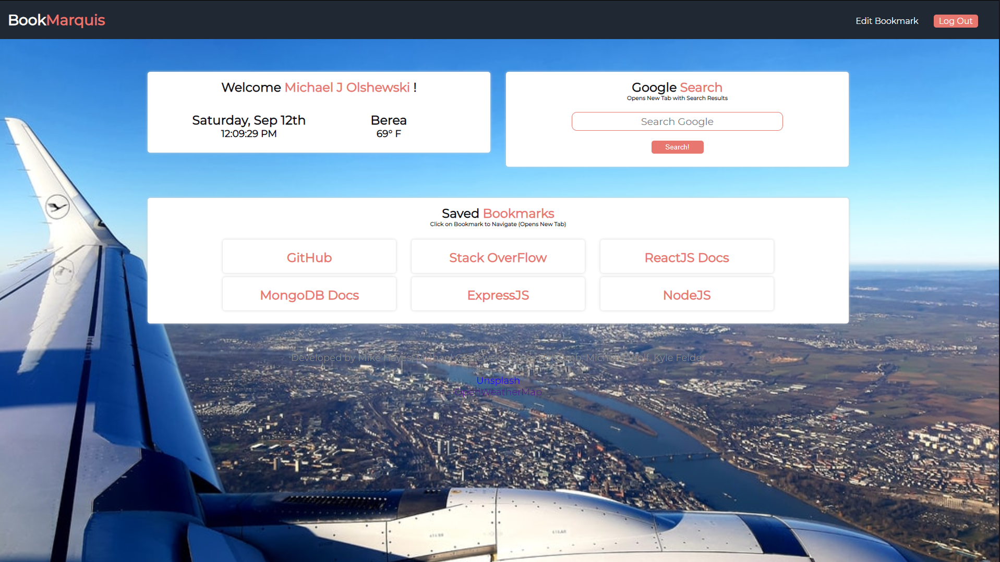

# BookMarquis

#### __*Collaborators*__

__Michael Hayes__ Focused mainly on the back end server development / connection UI with handlbars  
__Aaron Holcomb__ Focused mainly on the back end server development  
__Michael Olshewski__ Focused mainly on creating a polished user interface / Use of SCSS  
__Michelle Wolf__ Focused mainly on creating a polished user interface / design  
__Kyle Felder__ Focused mainly on the polished user interface, and connecting it with handlebars  

## __Details About This Project__

* Must use a Node and Express Server.
* Must Use Handlebars.js as the templating engine.
* Must be backed by a MySQL database with an ORM (We Chose Sequelize).
* Must utilize at least one new library, package, or technology that we haven't discussed.
* Must have a polished front end/UI.
* Must have a folder structure that meets the MVC paradigm.
* Must meet good quality coding standards (Indentation, Scoping, Naming).
* Must protect API keys in Node with environment variables.

## __Product Discussion__

We were given the choice of the type of project that we create, as long as we are within the guidelines and requirements for the application. Upon initial discussion to decide what we wanted to create, we decided to create a cross-platform bookmarking application, called Bookmarquis (pronounced 'Bookmarkee'). Our thought process for creating this application was this: "As a developer, the default google chrome new tab page only allows for ten (10) quick access links, and a google search bar, any other links have to be in the bookmark bar, and may be nested inside of other bookmark folders, and you may have 100's of bookmarks depending on different language documentation, links that you regularly need and so on. As a solution something that messes up efficiency when developing, we create the application to display all of your bookmarks on one page.

## __How To Install__

You will need to clone the repository on to your local machine. Once cloned, open the main project directory and run `npm install` to install all required dependencies. Once completed, you will want to ensure you have a database named `passport_demo` before running `npm run watch` or `npm start`. `npm start` will just start the server and will not restart based on saved changes. `npm run watch` will start the server with nodemon and will restart the server based on any saved changes that were made locally while the server is running.

## __How To Use__

Once you have the database created, and the server has started with no errors, navigate in your web browser with the link that is outputed in the terminal. You will need to create an account on the application using your name, email, and desired password. Once you have an account, created, you will need to log in. Once logged in, you can navigate to `Edit Bookmarks` to add a bookmark, Enter your desired bookmark name, and the url (please keep in mind, only put `www.yourlinkhere.com/` in the url input, it will default to `https://` when you click on the link). Create as many bookmarks as you would like and view them on `View Bookmarks`. If you've made a mistake on the bookmark, you can either delete it, or choose to edit it. In order to edit the bookmark, enter your desired information for a new bookmark, and click edit on the bookmark you would like to edit.

## __Stretch Goals__

We have a few stretch goals for this application. We were planning on using jQuery UI to allow draggable's and droppables so you can customize the locations of bookmarks, so you can set your most used bookmarks towards the top and the lesser, but nice to have, towards the bottom. We would also like and are planning on adding a Work Day Scheduler and a To-Do List on the main page that would also be accessible on other devices. We plan on working forward on the development and making this into a tool that all developers would love to have in their tools.

### __Link To Deployed Application__
https://bookmarquis.herokuapp.com/

### __Image of Main Page__
